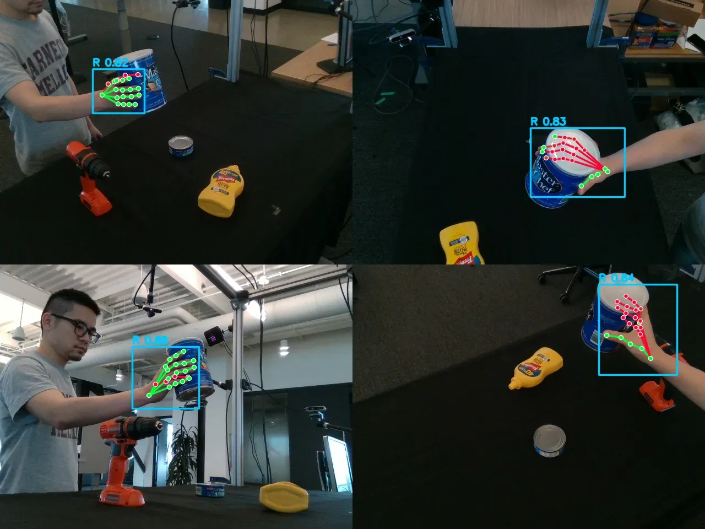

<div align="center">

# Hand Visibility Detector: Per-Keypoint Visibility Estimation for Hands

[Ryosei Hara](https://ryhara.github.io/)<sup>1,2</sup>,
[Masashi Hatano](https://masashi-hatano.github.io/)<sup>4</sup>,
[Rintaro Yanagi](https://yanarin.github.io/)<sup>2</sup>,
[Atsushi Hashimoto](https://atsushihashimoto.github.io/cv/)<sup>3</sup>,
[Takuma Yagi](https://artilects.net/)<sup>2</sup>,
[Mariko Isogawa](https://isogawa.ics.keio.ac.jp/)<sup>1,2</sup>


<sup>1</sup> Keio University, <sup>2</sup>National Institute of Advanced Industrial Science and Technology (AIST),<br>
<sup>3</sup> OMRON SINIC X Corporation, <sup>4</sup>The University of Tokyo

<font color="red"><strong>arXiv 2026</strong></font>

<a href='https://arxiv.org/abs/2608.11574'></a>
[](https://huggingface.co/spaces/ryhara/hand-visibility-detector)
[](https://huggingface.co/ryhara/hand-visibility-detector)

</div>


<!-- https://github.com/user-attachments/assets/d0e3ba63-4497-4e21-927b-d548201e2640 -->


https://github.com/user-attachments/assets/1b7172b1-9259-4437-b786-0963fc941ae9


[To Video](./assets/video.mp4)

<!--  -->


## Update
- [x] 2026/08/12 paper is now available on arXiv!
- [x] 2026/07/10 add other backbone (cspnext, resnet, vit, hamer)
- [x] 2026/07/09 add demo_video.py, add joint rotation visualization
- [x] 2026/07/06 use ego4d data, fix training code, add evaluation code
- [x] 2026/04/17 add training code
- [x] 2026/04/17 publish to github

## Installation

### As a dependency (import from your project)

```bash
uv add git+https://github.com/ryhara/hand_visibility_detector.git
# with the Gradio demo extras
uv add "hand-visibility-detector[demo] @ git+https://github.com/ryhara/hand_visibility_detector.git"
```

Or with `pip`:

```bash
pip install git+https://github.com/ryhara/hand_visibility_detector.git
pip install "hand-visibility-detector[demo] @ git+https://github.com/ryhara/hand_visibility_detector.git"
```

### Running this repository locally (clone & run demo)

```bash
git clone https://github.com/ryhara/hand_visibility_detector.git
cd hand_visibility_detector
uv sync                  # base deps
uv sync --extra demo     # + Gradio demo deps
uv sync --extra train    # + training deps (omegaconf, tqdm, scikit-learn, wandb, opencv-python, matplotlib)
uv sync --all-extras     # all extras
```

## Demo

Image:

```bash
python demo.py path/to/image.jpg -o output.jpg
```
- `--hand-conf`: hand detection confidence threshold
- `--show-global-orient`: wrist rotation visualization
- `--show-hand-pose`: per-joint rotation visualization

Video:

```bash
python demo_video.py path/to/video.mp4 -o output.mp4
```

Gradio UI:

```bash
python demo_gradio.py
```
※ Hand bounding boxes and poses are estimated using WiLoR, whereas per-keypoint visibility estimation is performed using our own method.

## Training

```bash
uv sync --extra train
```

```bash
# HInt (frozen WiLoR backbone + head-only training)
python -m training.train --config training/configs/hint.yaml

# COCO-WholeBody
python -m training.train --config training/configs/coco.yaml

# Override any field via dotted OmegaConf args, e.g.
python -m training.train --config training/configs/hint.yaml \
    data.hint_root=/mnt/ssd2/HInt_annotation \
    train.out_dir=runs/hint_run1 \
    wandb.enabled=false
```

## Evaluation
```bash
# HInt test subsets
python -m training.evaluate --config training/configs/hint_eval.yaml

# COCO-WholeBody hand val
python -m training.evaluate --config training/configs/coco_eval.yaml

# Override any field via dotted OmegaConf args, e.g.
python -m training.evaluate --config training/configs/hint_eval.yaml \
    data.hint_root=/mnt/ssd2/HInt_annotation \
    output.dir=outputs/eval_run1
```

## Dataset

- [COCO-WholeBody Dataset](https://github.com/jin-s13/COCO-WholeBody)
    ```bash
    curl -LO http://images.cocodataset.org/zips/train2017.zip
    curl -LO http://images.cocodataset.org/zips/val2017.zip
    curl -LO http://images.cocodataset.org/annotations/annotations_trainval2017.zip
    ```

    ```bash
    COCO-WholeBody/
    ├── annotations
    │   ├── coco_wholebody_train_v1.0.json
    │   └── coco_wholebody_val_v1.0.json
    ├── train2017
    │   ├── XXXXXXXXXXXX.jpg
    │   └── ...
    └── val2017
        ├── XXXXXXXXXXXX.jpg
        └── ...
    ```

- [HInt Dataset](https://github.com/ddshan/hint)
    ```bash
    wget --no-check-certificate https://fouheylab.eecs.umich.edu/~dandans/projects/hamer/HInt_annotation_partial.zip
    ```

    *: we need to download the ego4d dataset from the official website. Check the [HInt Dataset](https://github.com/ddshan/hint) for more details.

    ```bash
    HInt_annotation/
    ├── TEST_ego4d_img*
    ├── TEST_ego4d_seq*
    ├── TEST_epick_img
    ├── TEST_newdays_img
    ├── TRAIN_ego4d_img*
    ├── TRAIN_epick_img
    ├── TRAIN_newdays_img
    ├── VAL_ego4d_img*
    ├── VAL_ego4d_seq*
    ├── VAL_epick_img
    └── VAL_newdays_img
    ```

## License

This project is released for **research and non-commercial use only with proper attribution and citation required**, inheriting the most restrictive terms of its upstream dependencies. Any use of this code, weights, or derivatives must comply with **all** of the following:

- [COCO-WholeBody](https://github.com/jin-s13/COCO-WholeBody)
- [HInt](https://github.com/ddshan/hint)
- [WiLoR](https://github.com/rolpotamias/WiLoR) (and [WiLoR-mini](https://github.com/warmshao/WiLoR-mini))
- [HaMeR](https://github.com/geopavlakos/hamer)
- [MANO](https://mano.is.tue.mpg.de/)
- [Ultralytics](https://ultralytics.com/)

## Citation

If you use this software, please cite it as:

```bibtex
@misc{hara2026handvisibilitydetector,
      title={Hand Visibility Detector: Per-Keypoint Visibility Estimation for Hands}, 
      author={Ryosei Hara and Masashi Hatano and Rintaro Yanagi and Atsushi Hashimoto and Takuma Yagi and Mariko Isogawa},
      year={2026},
      eprint={2608.11574},
      archivePrefix={arXiv},
      primaryClass={cs.CV},
      url={https://arxiv.org/abs/2608.11574}, 
}
```

<p align="center">
  <picture>
    <source media="(prefers-color-scheme: dark)" srcset="https://raw.githubusercontent.com/ryhara/star-history/main/charts/ryhara_hand_visibility_detector_dark.svg">
    
  </picture>
</p>


<!-- [](https://www.star-history.com/?repos=ryhara%2Fhand_visibility_detector&type=date&legend=top-left) -->
